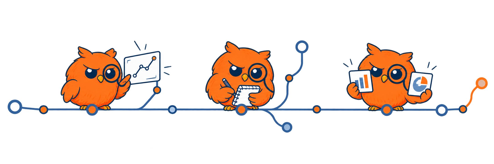
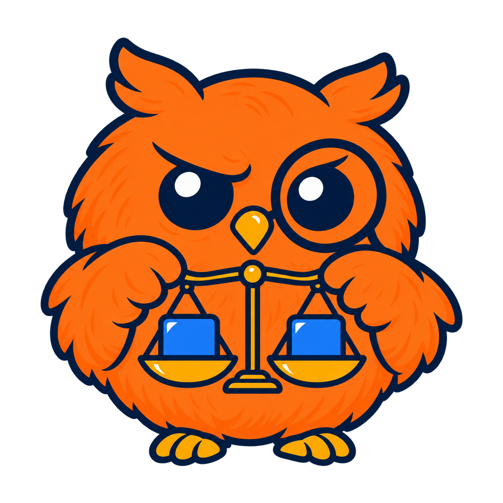

<strong>KURZ / CHANGYM963</strong>

# Financial AI, thoughtfully built.

I study how AI systems make decisions: **fairly, independently, and under real-world constraints**. I turn those questions into runnable research demos and practical tools.

  

[Research](#research) · [Tools](#tools) · [Stack](#stack)

<h2> Selected research</h2>

<h3> MAI</h3>

**Independent reasoning in a crowd.** A context-adaptive framework for measuring majority-alignment drift and decision reliability in financial multi-agent LLM systems.

Multi-agent behavior · Evaluation · Interventions

[Explore project →](https://github.com/ChangYM963/MAI) · [Methods](https://github.com/ChangYM963/MAI/blob/main/docs/methodology.md) · [Reproducibility](https://github.com/ChangYM963/MAI/blob/main/docs/reproducibility.md)

<h3> FinFair</h3>

**Fairness under real constraints.** A research demo exploring demographic robustness, counterfactual invariance, and lightweight financial decision models.

Financial AI · Robustness · Lightweight deployment

[Explore project →](https://github.com/ChangYM963/Finfair)

<h2> Tools &amp; experiments</h2>

- **[Gemini Web Shell](https://github.com/ChangYM963/gemini-web-shell)** · An unofficial Electron desktop wrapper for Gemini Web
- **[GitHub Followers Search](https://github.com/ChangYM963/Github_followers)** · A local follower search utility with keyword and fuzzy matching
- **[Transformers Code](https://github.com/ChangYM963/transformers-code)** · A fork for hands-on Transformers practice, fine-tuning, and PEFT

<h2> Working stack</h2>

**Research** · Python / PyTorch / Transformers / PEFT / Datasets / Accelerate  
**Building** · Electron / Node.js / GitHub API

More experiments & GitHub activity

 

[MAI Herding Test](https://github.com/ChangYM963/mai-herding-test) is a compact demo of financial multi-agent herding evaluation.

[Activity on GitHub](https://github.com/ChangYM963)

